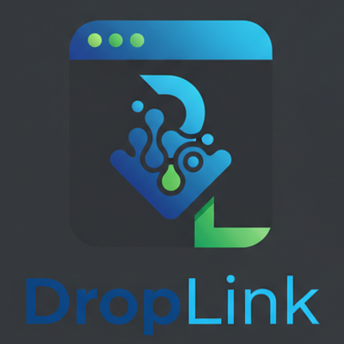

# DropLink



DropLink lets you send the current browser tab from one machine to another with almost no setup. A lightweight Node.js service receives shared links and relays them over WebSockets, while a Chrome/Edge extension triggers desktop notifications so the other device can open the page instantly.

## Features
- One-click sharing of the active browser tab to any named channel.
- Instant WebSocket notifications with an “Open” button so the recipient can jump straight to the page.
- Persistent preferences for channel, display name, and server URL.
- Health check and REST endpoint to pull the latest shared link, useful for scripting or future clients.

## Project Structure
```
droplink/
├── server/           # Express + WebSocket broker (Node.js)
└── extension/        # Chrome/Edge extension (Manifest V3)
```

## Requirements
- Node.js 18+ (for the server)
- Google Chrome or Microsoft Edge (for the extension)

## Getting Started

### 1. Run the server
```bash
cd server
cp .env.example .env
npm install
npm start
```
The server listens on `http://localhost:8080` by default. If you plan to use it across networks, deploy it behind HTTPS and map `/ws` through WSS.

### 2. Load the browser extension
1. Open `chrome://extensions` (or `edge://extensions` in Edge).
2. Enable **Developer mode**.
3. Choose **Load unpacked** and select the `extension/` directory.
4. Click the DropLink icon, enter your channel, display name, and the server URL, then save.

### 3. Share a tab
1. On machine A, open a page and click **Share current tab** in the popup.
2. On machine B (using the same channel), allow notifications from the browser and click **Open** when the DropLink notification appears.

## Configuration Notes
- The extension automatically reconnects to the server whenever preferences change or the browser restarts.
- `/share` accepts `channel`, `url`, `title`, and `from`. The server broadcasts the payload to every WebSocket client listening on that channel.
- `/latest?channel=...` returns the most recently shared payload for that channel, which can power additional tooling.

## Production Considerations
- Always serve the backend over HTTPS with WSS when sharing links across networks.
- Replace the in-memory channel store with Redis or another database if you need durability or history.
- Add authentication per channel (for example, a token stored in the extension options) before exposing the service publicly.
- Restrict CORS to the domains you trust.

## Contributing
Pull requests are welcome. Please open an issue if you run into bugs or have ideas for improvements—keyboard shortcuts, clipboard integration, or link history would all make great additions.
